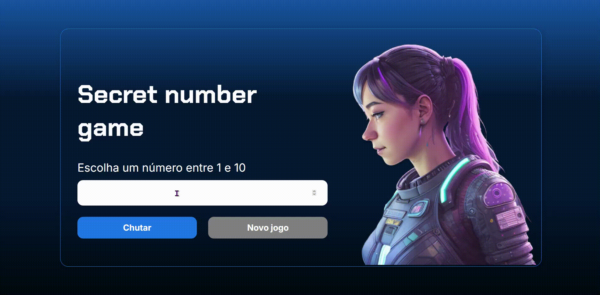

<h1 align="center">
  
</h1>

Este é um simples jogo de adivinhação de números feito em JavaScript. O objetivo é adivinhar um número secreto gerado aleatoriamente entre 1 e 10, com o feedback em tempo real sobre se o número correto é maior ou menor. O jogo utiliza a biblioteca **responsiveVoice** para fornecer feedback de voz em português.

## Funcionalidades
- **Geração de número aleatório**: Um número secreto é gerado aleatoriamente entre 1 e 10.
- **Interação com o usuário**: O usuário insere um número para tentar adivinhar o número secreto.
- **Feedback de voz**: O jogo oferece dicas em áudio, indicando se o número inserido é maior ou menor que o número secreto.
- **Controle de tentativas**: O número de tentativas é contado e exibido ao final.
- **Reiniciar o jogo**: Ao acertar o número, o usuário pode reiniciar o jogo e tentar novamente.

## Como o jogo funciona
1. Ao carregar a página, o jogo exibe uma mensagem inicial solicitando que o usuário insira um número entre 1 e 10.
2. O usuário insere um número e o sistema informa se o número secreto é maior ou menor.
3. Quando o usuário acerta o número, o jogo informa quantas tentativas foram necessárias.
4. O jogo pode ser reiniciado clicando no botão "Reiniciar", que só é habilitado após o acerto do número.

<h1 align="center">

</h1>
